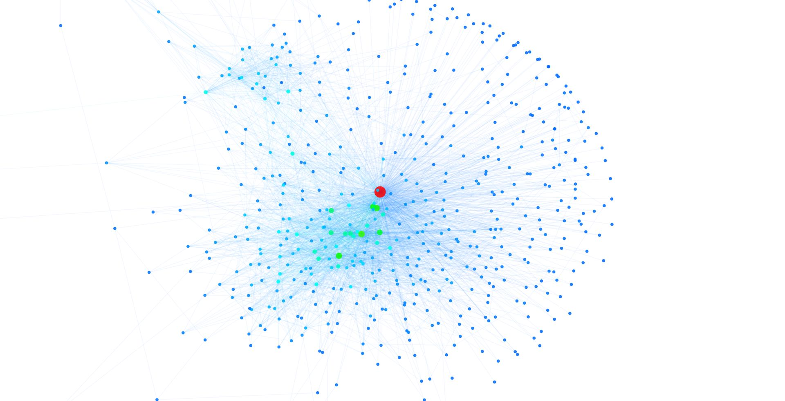

# Tweetopo

[](https://travis-ci.org/zthxxx/tweetopo)
[](https://coveralls.io/github/zthxxx/tweetopo?branch=master)
[](https://codeclimate.com/github/zthxxx/tweetopo)
[](https://www.python.org/)

A simple spider for Twitter interpersonal topology.

## preview


## What's this?

This is design for analyse **relation** between  seed users's friends, to get the **topology distribution heatmap** and the **core persons** in circle of relationship.

As shown above, the net graph consist of 1200+ friends by 3 seed users.

The three, which **two** of them are each **especial relevance**, while the **another** is **irrelevant** to either. So their friends obvious divided into **two almost separate communities** in the picture.

A node represents a person, a edge represents which two follow each. Nodes and edges dye as **heatmap**, the color from warm to cool represent the node rank value from high to low. The warmer the color, the more important the node, the colder the color, the more irrelevant the node.

Strong (warm, red)   ------>    Weak (cool, blue)


Zoom in two communities separately to analyse. As show below, this is a relationship distribution heatmap which consist of the **irrelevant** seed user's friends. The user have numerous followings, but between each followings almost have no intersection, and clustering rank value is very low overall. So the distribution is scattered, sign that these friends are not in a "Circle of Friend".



Zoom in another side, as show below, this distribution consist of the two **relevant** seed user's friends. Not only are the two user each especial relevance, but also most of their friends are each close relation, they are obvious in a "Circle of Friend", and these are the target of our research.


In the above, there are many blue node (sign that low-level relevance) around the border of bunching core, these aren't  the target of our research.

In order to find the **"core"** of the community bunching, I have tried seven or more kinds algorithms for measure, then the three algorithms with good results in the experiment are retained. They are **`Degree Centrality`, `Pagerank`, `Clustering Coefficient`**. Every  measure algorithm will filter nodes which rank value  greater than designated threshold (0 to 1).

To show the effect, let's choose only **one target** user's all friends, plot distribution and filter core.

As show below, it's **all friends** distribution heatmap:


Filter **core nodes** whitch rank value greater than 0.3 through `pagerank` as show below:


Mostly achieve the basic project.


## Usage

**Its need python 3.5 and above.**

### Install

First install require packages of python,

```bash
# recommend to use venv
$ python -m venv venv
$ source venv/bin/activate
# or in win
# > venv\Scripts\activate.bat
$ pip install -r requirements.txt
```

### config

Then change the config file for **your own info**, and institute rules of how to focus.

```bash
$ cp tweetconf.json.example tweetconf.json
$ vim tweetconf.json
$ cp rules.json.example rules.json
$ vim rules.json
```

In the config json file, you need set `twitter tokens` and `mongo connetion` and `seed user`.

`twitter tokens` and `seed user name` are a list, so you can set multi item of them, `tokens` will be used in multitheading for spider, and `seed names` decide who we crawl and analyse with. Persons info and relation stored in mongo.

### Unit test

Before run the project, you can get **unit test** at first, it used `nose`, a unit testing framework of python. 

```bash
$ packages="conffor, database, logsetting, netgraph, twitter"
$ python -m nose -w . -vs --with-coverage --cover-package="$packages"
```

**Note:** database test need MongoDB and config in test package as `db_unit_test.json`; Twitter test need key and token which configured in `tweetconf.json`.

### Entry

File struct:

```shell
tweetopo/       # root directory
│
├─ document/    # doc and image
│
├─ twitter/     # twitter spider with tweepy
│
├─ netgraph/    # graph struct process and data visualization
│
├─ database/    # package for database operate
│
├─ conffor/     # package for config and csv operate
│
├─ logsetting/  # package for log system setting
│
├─ tests/       # unit test
│
├─ uitls/       # uitl code snippets
│
├─ scripts/     # splited scripts for operation
│
├─ README.md
├─ requirements.txt
├─ rules.json       # focus filter rules
├─ tweetconf.json   # config file
└─ main.py          # entry for run scripts
```

The `main.py` is entry of twitter spider for get data, and database operate for store and export data.

`analyse_topology.py` is entry of csv file operate for cache data list, and graph analyse for data visualization, and draw result picture.

### workflow

1. crawl and store twitter user relation data with seed
2. export db relation to `relations.json` with seed user friends
3. calculate each mutual friends cache in `mutual_friends.csv`
4. load `mutual friends` file to edges with create graph struct
5. filter low rank node out  for cache hub node to `hub_persons.csv`
6. draw net graph, PDF, CDF
7. crawl and store twitter user details data with `hub persons` uid list
8. export db person to `hub_persons.json` with `hub persons` uid list
9. filter focus user which hit select rules to `focus_hub.csv`
10. merge hub list and details data to `hub_details.csv`

The result `hub_details.csv` record people`s uid, name, 3 measure ranks, lcation, description and other account details information.

## License

GPL
